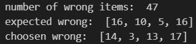
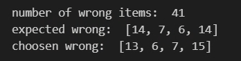

# CPEN455 2023 W2 Course Project: Conditional PixelCNN++ for Image Classification

Author: Guan Zheng Huang
ID: 67321109

## Models:
- `conditional_pixelcnn.py`: This is the primary model used for evaluation. It has not been fine-tuned.
  - Test Accuracy: 88.6%, FID: 21.3
  - Execution scripts for this model are `run.ps1` and `run_cont.ps1`.
    - The first script stops at batch 500, which the second script continues from and stops at batch 275.

- `experiment_perpixel.py`: This model is trained using the per-pixel technique and has been fine-tuned for 150 epochs.
  - Test Accuracy: 87.6%
  - Execution scripts for this model are `run_pp.ps1` and `run_pp_ft.ps1`.
    - The first script stops at batch 475, which the second script continues from and stops at batch 80.

## Statement on Resource Use:
- Utilizes a single GPU: Nvidia 2070 Super Max-Q Laptop GPU.
- Main model training duration: 16 hours, plus an additional 2 hours for fine-tuning.
- Training a reduced parameter model with [resnet = 1, filter = 40, logistical mix = 10] for 350 epochs took 3 hours.
- Relies solely on packages listed in `requirements.txt`.
- Total training process approximately lasted 24 hours.
- CUDA version: 12.4.131,
- PyTorch version: 2.2.1 cuda121
- Python version: 3.10.13.
- All seeds and sources of randomness are controlled, including during inference, training, and fine-tuning processes. Refer to the code for seed usage.
  - Unless otherwise stated, the PyTorch training seed is set at 4399, and the randomness seed at 42.

## Finetuning:
- The `pcnn_train.py` file has been modified to enable fine-tuning of models. Users can now configure the classes on which they want the model to train. Based on observed results, this customization considerably enhances the balance between the model's preferences for specific classes. Below, we compare the error of an un-fine-tuned model with that of a fine-tuned model.
  
  

- To finetune, one pass in the model path through `--load_params` then `--finetune` is configured as a string of integers, which include the classes to train on. For example, `--finetune 13` will train on classes 1 and 3. By default, the model will use a combination of training and validation data to finetune, this is because to select the checkpoint to finetune, the validation set is already used hence is no longer "clean", therefore, it is a justified choice to use the new data to improve model performance for the test set.

## Statement on Overfitting to Test Data
- Inevitably, optimizing a model for performance on the validation dataset may lead to overfitting on the test set once evaluated.
- To mitigate this issue, each model configuration was limited to three evaluations against the test set using the top three performing checkpoints from the validation set.

## Code Cleanliness
- The code has been cleaned for readability; hence, it might not include some structures highlighted in the report. Primary components of such structures are demonstrated in the `layers.py` file.

## Obtaining Test CSV, Logit, and Enhanced Validation Using Segmentation Techniques
- `classifier_plus.py` is a superset of the `classification_evaluation.py` file and can be run in the following modes with the `--mode` parameter:
  - **base**: Similar to the base classifier, this mode will additionally output all erroneous predictions to a file, `wrong_items.json`, which can be analyzed using `test.ipynb`.
  - **smart**: Performs various image augmentations before prediction, then votes on different versions of the image to handle issues like objects being too small, horizontally flipped, or having distinct characteristics only in segments of the image. It uses logit voting, where a highly confident decision significantly impacts model performance. Segmentation was found unhelpful and is disabled by default; however, image flipping, which can increase accuracy, is enabled.
  - **all**: Given a folder, this mode runs all `.pth` files within the folder against the validation set. Errors are not recorded; all results are ordered and formatted as a list.
  - **test**: Given a list of models (preferably those selected from the "all" mode results), this mode runs them against the test set and outputs the CSV and logits into a directory, each file named according to the model.

## Visualization and Other Tools
- `test.ipynb` is a Jupyter notebook used to visualize the `wrong_items.json` file. It can also visualize the logits and CSV files generated by `classifier_plus.py` and format the sampled images in various ways for further analysis.

## New Files
- `report.tex`, `report.pdf`, `neurips_2023.sty`, `report_data` directory: The report documents.
- `README_TECH.md`: This file, containing technical information about the project.
- `wrong_items.json`: A sample file containing wrongly predicted items, which can be visualized with `test.ipynb`.
- `test.ipynb`: Notebook as described above.
- `classifier_plus.py`: Classification evaluation script as described above.
- `run.ps1`, `run_cont.ps1`, `run_pp.ps1`, `run_pp_ft.ps1`: Run files for the models described above, compatible with Windows systems.
- `results_conditional_pixelcnn_loss.npy`: Contains the loss data used to generate the logits [519, 4].
- `results_conditional_pixelcnn_logits.npy`: Contains the logits for the test predictions [519, 4].
- `results_conditional_pixelcnn.pth.csv`: The CSV file for the test predictions, contains probabilities.
- `samples` directory: Contains the sampled images for the test predictions, 25 images per class, 100 images in total.

## Limitations:
- All process and all models architectures are  only configured to work with 4 classes and of shape 32 by 32, and class name [Class0, Class1, Class2, Class3], adjustments require inline modification such as my_dict and other hardcoded values. 